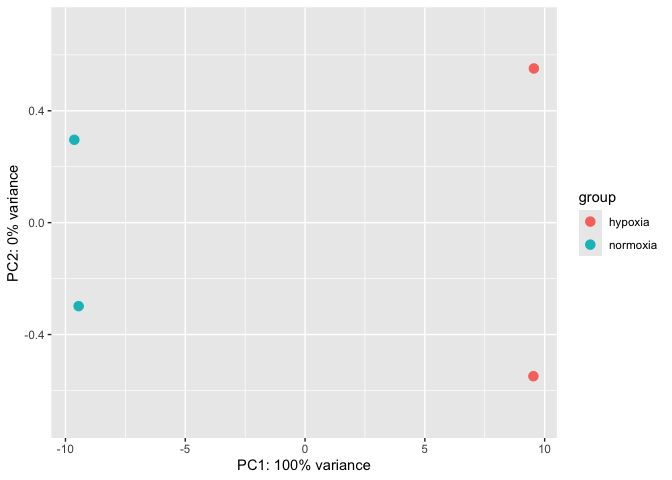
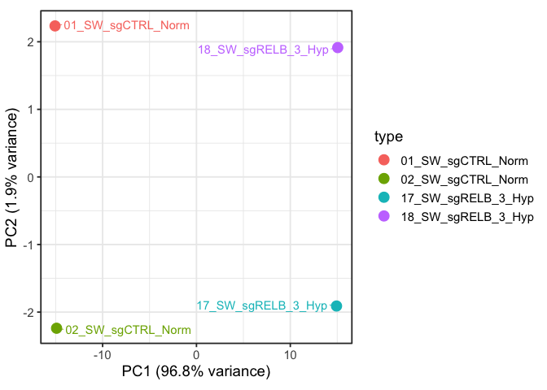
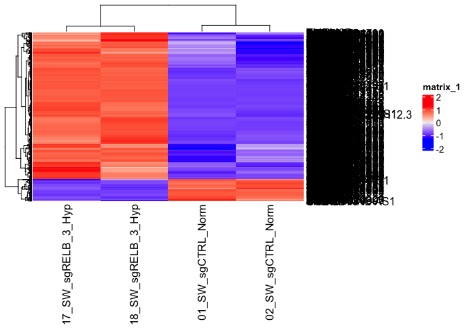
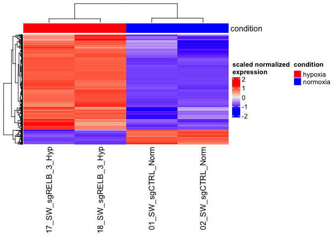
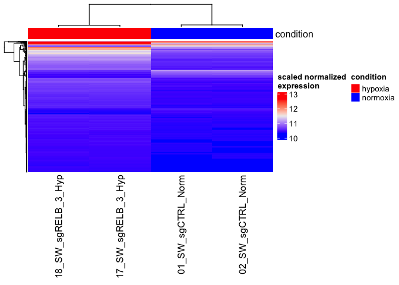

---
author:
- Jaakko
authors:
- Jaakko
conda:
  environment: bioinfo
date: 2025-11-20
execute:
  echo: true
  eval: true
title: 2DE_Heatmap
toc-title: Table of contents
---

<!-- TOGGLE BUTTON -->
<button id="theme-toggle" onclick="toggleTheme()" style="
 position: fixed;
 top: 15px;
 right: 15px;
 z-index: 9999;
 background: #232b3a;
 color: #d4d4d4;
 border: 1px solid #3d4758;
 padding: 6px 12px;
 border-radius: 6px;
 cursor: pointer;
 font-size: 0.8rem;
">

🌙 Dark Mode

</button>
<script>
// --- Inizializzazione ---
document.addEventListener("DOMContentLoaded", () => {
  const saved = localStorage.getItem("quarto-theme");
  if (saved === "light") setLight();
  else setDark();
});

// --- Funzione principale ---
function toggleTheme() {
  const current = localStorage.getItem("quarto-theme");
  if (current === "light") { setDark(); }
  else { setLight(); }
}

// --- MODE DARK ---
function setDark() {
  document.documentElement.classList.add("dark-mode");
  document.documentElement.classList.remove("light-mode");
  localStorage.setItem("quarto-theme", "dark");

  const btn = document.getElementById("theme-toggle");
  btn.innerHTML = "🌙 Dark Mode";
  btn.style.background = "#232b3a";
  btn.style.color = "#d4d4d4";
}

// --- MODE LIGHT ---
function setLight() {
  document.documentElement.classList.add("light-mode");
  document.documentElement.classList.remove("dark-mode");
  localStorage.setItem("quarto-theme", "light");

  const btn = document.getElementById("theme-toggle");
  btn.innerHTML = "☀️ Light Mode";
  btn.style.background = "#e8e8e8";
  btn.style.color = "#1e2433";
}
</script>

::: cell
<style type="text/css">
/* --- 1. RESET GENERALE --- */
body {
background-color: #1e2433;
color: #d4d4d4;
}

/* --- 2. CONTENITORE ESTERNO (IL BOX FISSO) --- */
div.sourceCode {
background: linear-gradient(90deg, #232b3a 0%, #232b3a 50px, #2d3648 50px, #2d3648 100%) !important;
border: 1px solid #3d4758;
border-radius: 6px;
margin-bottom: 1em;
position: relative;
padding-top: 34px !important;
}

/* --- 3. CODICE SCORREVOLE (PRE) --- */
div.sourceCode pre {
background-color: transparent !important;
border: none !important;
}

/* --- 4. NUMERI DI RIGA --- */
div.sourceCode pre code a,
div.sourceCode pre code span.a,
div.sourceCode .linenos {
color: #636d83 !important;
text-decoration: none;
opacity: 1 !important;
}

/* --- 5. ETICHETTA LINGUAGGIO (HEADER) --- */
div.sourceCode::before {
content: "CODE";
position: absolute;
top: 0;
left: 0;
right: 0;
height: 34px;
background-color: #232b3a;
border-bottom: 1px solid #3d4758;
color: #7d899c;
display: flex;
align-items: center;
padding-left: 12px;
font-family: sans-serif;
font-size: 0.75rem;
font-weight: bold;
text-transform: uppercase;
border-top-left-radius: 5px;
border-top-right-radius: 5px;
z-index: 10;
}

/* --- 5b. Riconoscimento linguaggio --- */
div.sourceCode:has(.r),
div.sourceCode:has(.language-r) { }
div.sourceCode:has(.r)::before,
div.sourceCode:has(.language-r)::before { content: "R"; }

div.sourceCode:has(.bash),
div.sourceCode:has(.language-bash) { }
div.sourceCode:has(.bash)::before,
div.sourceCode:has(.language-bash)::before { content: "BASH"; }

div.sourceCode:has(.python),
div.sourceCode:has(.language-python) { }
div.sourceCode:has(.python)::before,
div.sourceCode:has(.language-python)::before { content: "PYTHON"; }

div.sourceCode:has(.css),
div.sourceCode:has(.language-css) { }
div.sourceCode:has(.css)::before,
div.sourceCode:has(.language-css)::before { content: "CSS"; }

div.sourceCode:has(.json),
div.sourceCode:has(.language-json) { }
div.sourceCode:has(.json)::before,
div.sourceCode:has(.language-json)::before { content: "JSON"; }

/* --- 6. OUTPUT (RISULTATI ARANCIONI) --- */
div.cell-output-stdout pre,
div.cell-output-stderr pre {
background-color: #2d3648 !important;
border: 1px solid #3d4758;
border-radius: 6px;
padding: 0.8em 1em !important;
}

div.cell-output-stdout pre, div.cell-output-stdout pre code,
div.cell-output-stderr pre, div.cell-output-stderr pre code {
color: #ff8866 !important;
}

/* --- 7. BOTTONE COPIA --- */
.code-copy-button {
position: absolute !important;
top: 6px !important;
right: 6px !important;
z-index: 100 !important;
background-color: #3d4758 !important;
color: #d4d4d4 !important;
border: 1px solid #4d5768 !important;
}

.code-copy-button:hover {
background-color: #4d5768 !important;
}

/* --- 8. DARK MODE - syntax highlighting --- */
:root.dark-mode .sourceCode .kw { color: #ff79c6 !important; } /* keywords - rosa */
:root.dark-mode .sourceCode .dt { color: #8be9fd !important; } /* data types - cyan */
:root.dark-mode .sourceCode .dv { color: #bd93f9 !important; } /* numeri - viola */
:root.dark-mode .sourceCode .st { color: #f1fa8c !important; } /* stringhe - giallo */
:root.dark-mode .sourceCode .co { color: #6272a4 !important; } /* commenti - grigio blu */
:root.dark-mode .sourceCode .fu { color: #50fa7b !important; } /* funzioni - verde */
:root.dark-mode .sourceCode .op { color: #ff79c6 !important; } /* operatori - rosa */
:root.dark-mode .sourceCode .va { color: #f8f8f2 !important; } /* variabili - bianco */
:root.dark-mode .sourceCode .at { color: #50fa7b !important; } /* attributi - verde */
:root.dark-mode .sourceCode .ss { color: #f1fa8c !important; } /* special strings - giallo */

/* ============================ */
/*     LIGHT MODE OVERRIDES     */
/* ============================ */

:root.light-mode body {
background-color: #e8eef5 !important;
color: #2c3e50 !important;
}

/* Box codice: sfondo chiaro + colonna numeri chiara */
:root.light-mode div.sourceCode {
background: linear-gradient(
90deg,
#d7d7e0 0%, #d7d7e0 50px,
#ffffff 50px, #ffffff 100%
) !important;
border-color: #bfc6d1 !important;
}

/* FORZA TUTTO IL TESTO NEL CODICE A ESSERE SCURO */
:root.light-mode div.sourceCode pre *,
:root.light-mode div.sourceCode pre code *,
:root.light-mode div.sourceCode span,
:root.light-mode div.sourceCode code span {
color: #383a42 !important;
}

/* numeri di riga */
:root.light-mode .linenos,
:root.light-mode div.sourceCode pre code a {
color: #6b7280 !important;
}

/* header del linguaggio */
:root.light-mode div.sourceCode::before {
background-color: #d7d7e0 !important;
color: #555 !important;
border-bottom: 1px solid #bfc6d1 !important;
}

/* output */
:root.light-mode div.cell-output-stdout pre,
:root.light-mode div.cell-output-stderr pre {
background-color: #ffffff !important;
border: 1px solid #bfc6d1 !important;
}

:root.light-mode div.cell-output-stdout pre code,
:root.light-mode div.cell-output-stderr pre code {
color: #a83200 !important;
}

/* bottone copia */
:root.light-mode .code-copy-button {
background-color: #d7d7e0 !important;
color: #383a42 !important;
border: 1px solid #bfc6d1 !important;
}

:root.light-mode .code-copy-button:hover {
background-color: #c7c7d0 !important;
}

/* LIGHT MODE - syntax highlighting personalizzato */
:root.light-mode .sourceCode .kw { color: #a626a4 !important; } /* keywords - viola */
:root.light-mode .sourceCode .dt { color: #0184bc !important; } /* data types - blu */
:root.light-mode .sourceCode .dv { color: #986801 !important; } /* numeri - arancione */
:root.light-mode .sourceCode .st { color: #50a14f !important; } /* stringhe - verde */
:root.light-mode .sourceCode .co { color: #a0a1a7 !important; } /* commenti - grigio */
:root.light-mode .sourceCode .fu { color: #4078f2 !important; } /* funzioni - blu */
:root.light-mode .sourceCode .op { color: #383a42 !important; } /* operatori - nero */
:root.light-mode .sourceCode .va { color: #383a42 !important; } /* variabili - nero */
:root.light-mode .sourceCode .at { color: #4078f2 !important; } /* attributi - blu */
:root.light-mode .sourceCode .ss { color: #50a14f !important; } /* special strings - verde */
:root.light-mode .sourceCode .sc { color: #383a42 !important; } /* special char - nero */
:root.light-mode .sourceCode .bn { color: #986801 !important; } /* base n - arancione */
:root.light-mode .sourceCode .fl { color: #986801 !important; } /* float - arancione */
:root.light-mode .sourceCode .ch { color: #50a14f !important; } /* char - verde */
:root.light-mode .sourceCode .cn { color: #383a42 !important; } /* constant - nero */
</style>
:::

## Quarto

This is a Quarto document. Quarto is a multi-language, next-generation
version of R Markdown. Check the
[tutorial](https://quarto.org/docs/get-started/hello/rstudio.html).\
N.B. - Learn the IT foundations to master bioinformatics tools and
softwares, and prevent getting tangled on the infamous "dependency
hell". Ask for the "Foundations of Bioinformatics Infrastructure".

## Create and activate the environment "bioinfo"

::: cell
``` {.bash .cell-code}
mamba create -n bioinfo python=3.11
mamba activate bioinfo
```
:::

## Download the RNA-seq dataset

Let's use a real example - [*RNA-seq of ITPR3 and RELB knockout in SW480
under normoxia and hypoxia*]{.underline} (*Homo sapiens*)
<https://www.ncbi.nlm.nih.gov/geo/query/acc.cgi?acc=GSE197576>.


N.B. - Structure properly your folder ('mkdir folder'):\

:::: cell
::: {.cell-output .cell-output-stdout}
    .
    ├── data/
    ├── scripts/
    └── results/
:::
::::

How to download the files from FTP with UNIX terminal:
<https://www.ncbi.nlm.nih.gov/geo/info/download.html>\
<https://ftp.ncbi.nlm.nih.gov/geo/series/GSE197nnn/GSE197576/suppl/>

::: cell
``` {.bash .cell-code}
# Move to /data folder !!!
cd data
wget https://ftp.ncbi.nlm.nih.gov/geo/series/GSE197nnn/GSE197576/suppl/GSE197576_raw_gene_counts_matrix.tsv.gz
```
:::

Alternative use GEOquery
<https://bioconductor.org/packages/release/bioc/html/GEOquery.html>.

## Check the data ad extract the samples of interest

Check the data in the compressed RNA-seq file.

::: cell
``` {.bash .cell-code}
zless -S GSE197576_raw_gene_counts_matrix.tsv.gz
# z because is compressed
# less is the faster command to view the conte of a file
# -S maintain one raw column
# press q to quit
```
:::

Install csvtk annd check the data in a pretty aligned manner.

::: cell
``` {.bash .cell-code}
mamba install -c bioconda csvtk
```
:::

::: cell
``` {.bash .cell-code}
csvtk pretty -t ../data/GSE197576_raw_gene_counts_matrix.tsv.gz | less -S
# -t tab the limit
# press q to quit
```
:::

:::: cell
``` {.bash .cell-code}
csvtk headers -t ../data/GSE197576_raw_gene_counts_matrix.tsv.gz 
```

::: {.cell-output .cell-output-stdout}
    gene
    01_SW_sgCTRL_Norm
    02_SW_sgCTRL_Norm
    03_SW_sgITPR3_1_Norm
    04_SW_sgITPR3_1_Norm
    07_SW_sgRELB_3_Norm
    08_SW_sgRELB_3_Norm
    11_SW_sgCTRL_Hyp
    12_SW_sgCTRL_Hyp
    13_SW_sgITPR3_1_Hyp
    14_SW_sgITPR3_1_Hyp
    17_SW_sgRELB_3_Hyp
    18_SW_sgRELB_3_Hyp
:::
::::

N.B - Get csvtk at <https://github.com/shenwei356/csvtk>

Extract the gene expression values from:

  --------------------- --------------------- ---------------------- ----------------------
  *01_SW_sgCTRL_Norm*   *02_SW_sgCTRL_Norm*   *17_SW_sgRELB_3_Hyp*   *18_SW_sgRELB_3_Hyp*

  --------------------- --------------------- ---------------------- ----------------------

:::: cell
``` {.bash .cell-code}
csvtk cut -t -f1,2,3,12,13 ../data/GSE197576_raw_gene_counts_matrix.tsv.gz | column -t | head
```

::: {.cell-output .cell-output-stdout}
    gene                       01_SW_sgCTRL_Norm  02_SW_sgCTRL_Norm  17_SW_sgRELB_3_Hyp  18_SW_sgRELB_3_Hyp
    DDX11L1                    0                  0                  0                   0
    WASH7P                     18                 11                 30                  25
    MIR6859-1                  5                  1                  8                   5
    MIR1302-2HG                0                  0                  0                   0
    MIR1302-2                  0                  0                  0                   0
    FAM138A                    0                  0                  0                   0
    OR4F5                      0                  0                  0                   0
    LOC100996442               9                  3                  15                  20
    LOC729737                  3                  3                  33                  45
:::
::::

::: cell
``` {.bash .cell-code}
csvtk cut -t -f1,1,2,12,13 ../data/GSE197576_raw_gene_counts_matrix.tsv.gz > raw.counts.tsv
```
:::

Your */data* folder now contains:

:::: cell
::: {.cell-output .cell-output-stdout}
    data/
    ├── GSE197576_raw_gene_counts_matrix.tsv.gz
    └── raw.counts.tsv
:::
::::

## Read the data into R and make a DESeq2 object

Follow the tutorial
<http://bioconductor.org/packages/devel/bioc/vignettes/DESeq2/inst/doc/DESeq2.html>.

### Setup

Install the R-packages for this project within the 'bioinfo' virtual
environment.

::: cell
``` {.bash .cell-code}
mamba install -c conda-forge r-tidyverse
mamba install -c conda-forge r-dplyr
mamba install -c conda-forge r-here
mamba install -c bioconda bioconductor-deseq2
mamba intall -c conda-forge r-ggplot2
mamba install -c conda-forge r-ggrepel
mamba install -c conda-forge r-BiocManager   
```
:::

Save the environment for reproducibility.

::: cell
``` {.bash .cell-code}
mamba env export --no-builds > bioinfo_environment.yml
```
:::

Open RStudio from the terminal: you are now working with the R software
within 'bioinfo' and you can find the packages previously installed.

::: cell
``` {.bash .cell-code}
open -na RStudio
```
:::

### Let's start

::::: cell
``` {.r .cell-code}
library(dplyr) #https://dplyr.tidyverse.org/
library(readr) #https://readr.tidyverse.org/
library(here) #https://cran.r-project.org/web/packages/here/vignettes/here.html
library(DESeq2) #https://genomebiology.biomedcentral.com/articles/10.1186/s13059-014-0550-8
library(ggplot2)
library(ggrepel)
BiocManager::install("ComplexHeatmap")
library(ComplexHeatmap)

raw_counts <- read_tsv(here("01_Heatmap_Genomics/2.DE_Heatmap/data/raw.counts.tsv")) #import the dataset

raw_counts_mat <- raw_counts[, -1] %>% as.matrix #create the values matrix removing the first column for DESeq2
head(raw_counts_mat)
```

::: {.cell-output .cell-output-stdout}
         01_SW_sgCTRL_Norm 02_SW_sgCTRL_Norm 17_SW_sgRELB_3_Hyp 18_SW_sgRELB_3_Hyp
    [1,]                 0                 0                  0                  0
    [2,]                18                11                 30                 25
    [3,]                 5                 1                  8                  5
    [4,]                 0                 0                  0                  0
    [5,]                 0                 0                  0                  0
    [6,]                 0                 0                  0                  0
:::

``` {.r .cell-code}
rownames(raw_counts_mat) <- raw_counts$gene #add row names to the matrix
head(raw_counts_mat)
```

::: {.cell-output .cell-output-stdout}
                01_SW_sgCTRL_Norm 02_SW_sgCTRL_Norm 17_SW_sgRELB_3_Hyp
    DDX11L1                     0                 0                  0
    WASH7P                     18                11                 30
    MIR6859-1                   5                 1                  8
    MIR1302-2HG                 0                 0                  0
    MIR1302-2                   0                 0                  0
    FAM138A                     0                 0                  0
                18_SW_sgRELB_3_Hyp
    DDX11L1                      0
    WASH7P                      25
    MIR6859-1                    5
    MIR1302-2HG                  0
    MIR1302-2                    0
    FAM138A                      0
:::
:::::

Make a dataframe for the metadata.

:::: cell
``` {.r .cell-code}
metaframe <- tibble(condition = c ("normoxia", "normoxia", "hypoxia", "hypoxia"))
rownames(metaframe) <- colnames(raw_counts_mat)
metaframe
```

::: {.cell-output .cell-output-stdout}
    # A tibble: 4 × 1
      condition
    * <chr>    
    1 normoxia 
    2 normoxia 
    3 hypoxia  
    4 hypoxia  
:::
::::

Make a DESeq2 object
([tutorial](http://bioconductor.org/packages/devel/bioc/vignettes/DESeq2/inst/doc/DESeq2.html)).

:::::: cell
``` {.r .cell-code}
all(rownames(metaframe) == colnames(raw_counts_mat)) #check
```

::: {.cell-output .cell-output-stdout}
    [1] TRUE
:::

``` {.r .cell-code}
dds <- DESeqDataSetFromMatrix(countData = raw_counts_mat, #input object with design
                              colData = metaframe,
                              design = ~ condition)
dds <- DESeq(dds) #DE analysis

?results
res <- results(dds, contrast = c("condition", "hypoxia", "normoxia")) #extract results from the analysis 

res %>% 
  as.data.frame() %>%
  arrange(padj <= 0.1, abs(log2FoldChange) >= 2) %>% #filter significant and substantial expression changes 
  head(n = 10)
```

::: {.cell-output .cell-output-stdout}
                   baseMean log2FoldChange     lfcSE       stat    pvalue      padj
    WASH7P        19.868995     0.41727500 0.5998607  0.6956198 0.4866669 0.6105208
    MIR6859-1      4.356427     0.65513668 1.3035290  0.5025870 0.6152547 0.7232638
    LOC100996442  10.646734     1.06292492 0.8520192  1.2475363 0.2122009 0.3229198
    WASH9P        50.042666     0.04451088 0.3788408  0.1174923 0.9064699 0.9408732
    LINC01409     12.417663     0.80294905 0.7708893  1.0415880 0.2976028 0.4204900
    FAM87B         2.852901    -0.33928196 1.5932534 -0.2129492 0.8313666 0.8900030
    LINC00115     24.063112    -0.30645340 0.5400642 -0.5674389 0.5704160 0.6854688
    LOC100288175 162.124769     0.20237040 0.2175051  0.9304167 0.3521554 0.4798503
    LOC105378948  39.581280     0.61997436 0.4277432  1.4494080 0.1472237 0.2390383
    RNF223         9.592991    -0.79713059 0.8827150 -0.9030442 0.3665025 0.4942234
:::

``` {.r .cell-code}
significant_genes <- res %>% #identify the respective genes
  as.data.frame() %>%
  filter(padj <= 0.1, abs(log2FoldChange) >= 2) %>%
  rownames()

significant_genes[1:10]
```

::: {.cell-output .cell-output-stdout}
     [1] "LOC729737"    "LINC02593"    "LOC107985728" "LOC107985376" "LINC02781"   
     [6] "LINC01714"    "C1orf167"     "NPPB"         "PADI2"        "PLA2G5"      
:::
::::::

### PCA Analysis to verify your results

:::: cell
``` {.r .cell-code}
vsd <- vst(dds, blind = F) #normalization applying a variance stabilizing transformation (VST)

p <- plotPCA(vsd, intgroup = c("condition"))
p + coord_cartesian(ylim = c(-0.7, 0.7))
```

::: cell-output-display

:::
::::

You can make a PCA by yourself.

::::::: cell
``` {.r .cell-code}
# vsd <- vst(dds, blind = F)
head(assay(vsd), 3)
```

::: {.cell-output .cell-output-stdout}
              01_SW_sgCTRL_Norm 02_SW_sgCTRL_Norm 17_SW_sgRELB_3_Hyp
    DDX11L1            10.31070          10.31070           10.31070
    WASH7P             10.48764          10.46633           10.51233
    MIR6859-1          10.40400          10.35764           10.41488
              18_SW_sgRELB_3_Hyp
    DDX11L1             10.31070
    WASH7P              10.49477
    MIR6859-1           10.39306
:::

``` {.r .cell-code}
?assay

normalized_vsd <- assay(vsd) %>% #from DeSeq object to matrix
 as.matrix()

pca_prcomp <- prcomp(t(normalized_vsd), center = T, scale. = F) #PCA analysis

names(pca_prcomp)
```

::: {.cell-output .cell-output-stdout}
    [1] "sdev"     "rotation" "center"   "scale"    "x"       
:::

``` {.r .cell-code}
pca_prcomp$x
```

::: {.cell-output .cell-output-stdout}
                             PC1       PC2       PC3           PC4
    01_SW_sgCTRL_Norm  -15.07327  2.234704 -1.602628  9.567716e-14
    02_SW_sgCTRL_Norm  -14.90781 -2.238765  1.619684 -4.871971e-15
    17_SW_sgRELB_3_Hyp  14.92560 -1.909982 -1.893329  1.475209e-14
    18_SW_sgRELB_3_Hyp  15.05548  1.914043  1.876273  1.168549e-13
:::

``` {.r .cell-code}
PC1_PC2 <- data.frame(
  PC1 = pca_prcomp$x[,1],
  PC2 = pca_prcomp$x[,2],
  type = rownames(pca_prcomp$x)
)

var_explained <- (pca_prcomp$sdev^2) / sum(pca_prcomp$sdev^2)
pc1_percent <- round(var_explained[1] * 100, 1)
pc2_percent <- round(var_explained[2] * 100, 1)

ggplot(PC1_PC2, aes(x = PC1, y = PC2, col = type)) +
  geom_point(size = 4) +
  geom_text_repel(
    aes(label = type),
    box.padding = 0.5,
    point.padding = 0.3,
    segment.size = 0.3,
    min.segment.length = 0
  ) +
  
  labs(
    x = paste0("PC1 (", pc1_percent, "% variance)"),
    y = paste0("PC2 (", pc2_percent, "% variance)")
  ) +
  
  coord_cartesian(clip = "off") + 
  theme_bw(base_size = 14) +
  theme(
    plot.margin = margin(10, 5, 10, 5),  
    legend.position = "right"
  )
```

::: cell-output-display

:::
:::::::

It is not exactly the same, what's going on?

::: cell
``` {.r .cell-code}
?plotPCA #using the top 500 most variable genes
```
:::

## Make a perfect heatmap

::::: cell
``` {.r .cell-code}
significant_mat <- normalized_vsd[significant_genes, ]
dim(significant_mat)
```

::: {.cell-output .cell-output-stdout}
    [1] 967   4
:::

``` {.r .cell-code}
Heatmap(t(scale(t(significant_mat))))
```

::: cell-output-display

:::
:::::

You get this perfect looking heatmap because you select the genes that
are different. So, no surprise at all!

::::: cell
``` {.r .cell-code}
metaframe
```

::: {.cell-output .cell-output-stdout}
    # A tibble: 4 × 1
      condition
    * <chr>    
    1 normoxia 
    2 normoxia 
    3 hypoxia  
    4 hypoxia  
:::

``` {.r .cell-code}
meta_annot <- HeatmapAnnotation(df = metaframe,
                                col = list(condition = c("hypoxia" = "red", "normoxia" = "blue")))

Heatmap(t(scale(t(significant_mat))),
        top_annotation = meta_annot,
        show_row_names = F,
        name = "scaled normalized\nexpression"
        )
```

::: cell-output-display

:::
:::::

why scaling is important?

:::: cell
``` {.r .cell-code}
Heatmap(significant_mat, 
        top_annotation = meta_annot,
        show_row_names = FALSE,
        name = "scaled normalized\nexpression"
        )
```

::: cell-output-display

:::
::::
